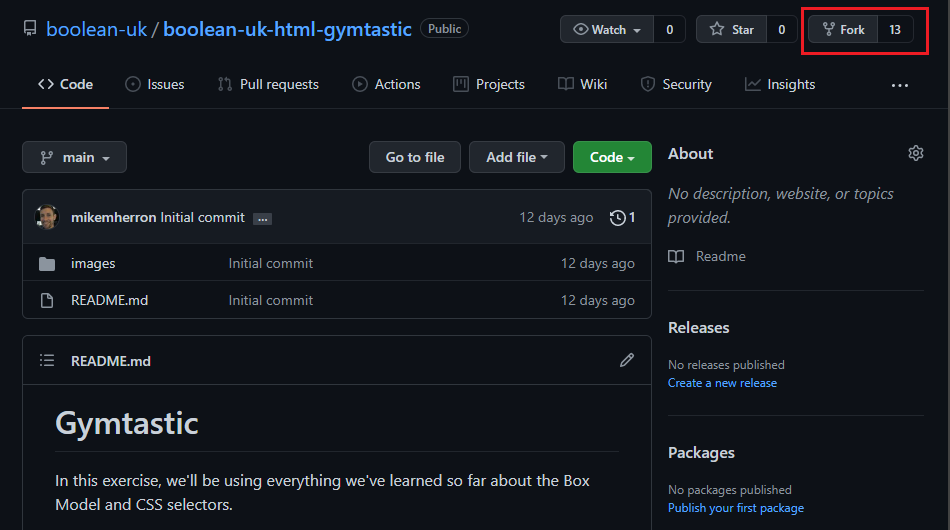
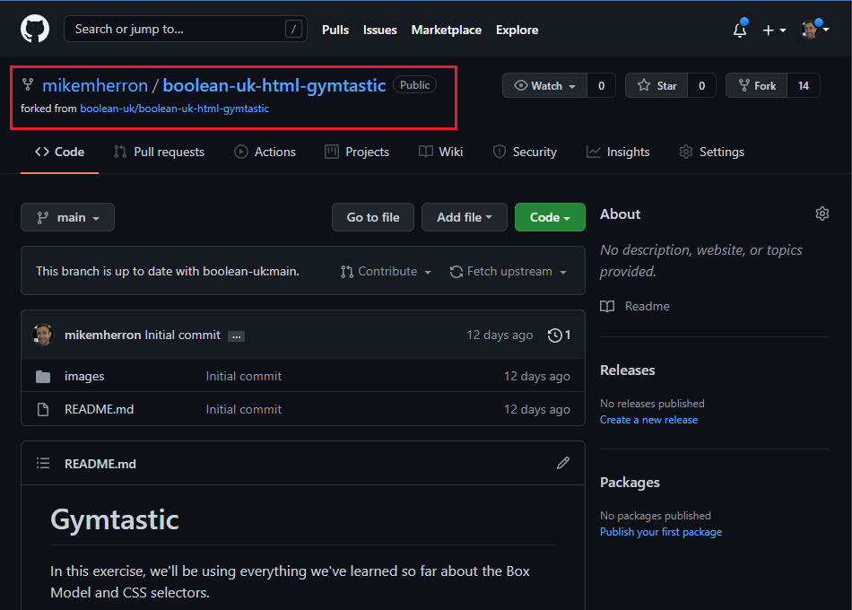
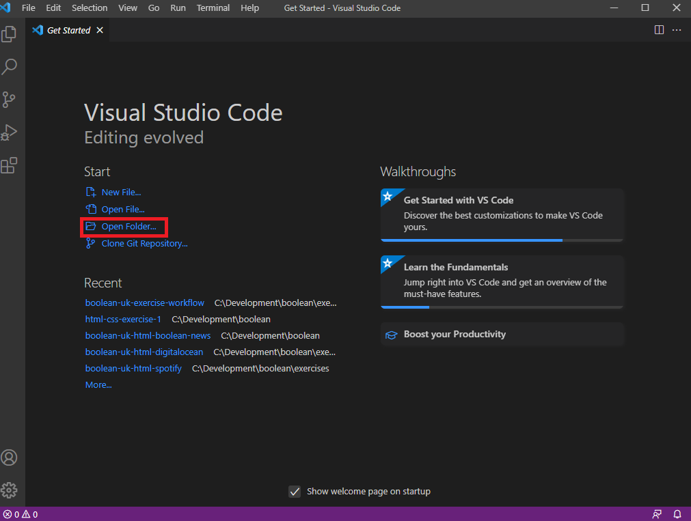
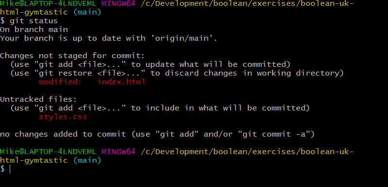

# Exercise Workflow
This page describes the workflow for afternoon exercises and projects at Boolean. When given an exercise, you will be provided with a link to a GitHub repository that contains the exercise instructions and any template code. 

Prior to following this guide you should have:

1. Signed up to a GitHub account
2. Been added to the relevant GitHub team for your Cohort (your instructor can invite you)
3. Have installed Git on your development machine
4. Have setup and configured SSH Keys

## 1. Fork the repository
The first step is **fork** the repository. You can do this from the repository page in GitHub by pressing the **fork** button in the top right corner:

Forking the repository takes a copy of the repository and add's it to your own GitHub account.

If you cannot see the exercise page or get an error trying to access it, contact your instructor. The cause is likely to be one of the following:

* You are not signed in to your GitHub account
* You have not been added to the GitHub team for your cohort
* The Cohort GitHub team has not been given access to the repository

## 2. Clone the fork
One the repository has been forked, you then *clone* the repository to your local machine. Cloning takes a copy of the repository from GitHub and stores it on your local machine so you can start working on it.
 
To clone the repository, go to the **forked* repository page in GitHub. This is the copy of the repository that should exist on  your account. You can verify you are looking at the forked copy bu checking for the message underneath the repository name:

From here, we want to press the green code button, then select the `SSH` tab, and then the copy icon to copy the repository SSH URL to the clipboard:

The repository SSH URL is what we need to provide to the Git command on our local machine to do the clone.

Once this is copied, open up your terminal on Mac or GitBash on Windows. Navigate in the terminal to the directory where you want to repository code to be cloned to and then use the `git clone` command with the copied SSH url (you should be able to right-click in your terminal to paste the url you copied) to clone the repository. Here is how it should look on GitBash on windows:

Once this command completes, you now have a copy of the repository on your local machine. You're now ready to start working on the exercise.

## 3. Work on the project in VS Code

Open VS Code and select the "Open Folder" option:

Then navigate to and select the folder where you checked out the repository. You are now able to work on the exercise using VS Code.

## 5. Stage and commit your changes

Once you are ready to commit your changes (see ), there are two steps to follow.

First, we need to tell Git what changes we want to include as part of the next commit. This is done through the `git add` command. If you are unsure what files you've changed, you can run the `git status` command from your repository root to view the current state of your repository:

In this example, git is telling us we have 2 changes that have not yet been staged. The `README.md` file has been modified and we've also added a new image `images/vs-code-open-project.png`. Before we can commit our changes, we need to *stage* them using `git add`:

### How often should you commit changes? 
This depends. If you Google that question you'll find a lot of different answers. Generally, commiting on every minor change is probably overkill, and commiting once per day is not often enough. A commit should encapsulate a small but meaningful change and represent some progress towards your end goal. A commit every 15-60 minutes is probably typical. Commits should also be *atomic* i.e. a single commit should encapsulate everything required to understand and implement a specific change. For example, if we update a `
` element in our HTML to add a `class` attribute and we then add some CSS style rules to that class in our stylsheet, both of those changes should be part of the same commit.

## 6. Push your changes

## Additional reading
